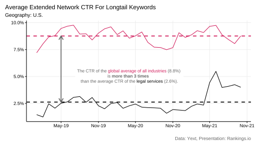

# Introduction 

Yext, a company providing _entreprise search_ solutions based on Natural Language Processing and AI, publish anonymized data on their [Search Data Hub](https://www.yext.com/search-data-hub). These data are samples of listing and local page data across a variety of search engines, and other digital endpoints collected by Yext from their clients. They allow for exploring insights on consumer behavior trends — including shifts in search volume and foot traffic trends by industry. 

We have analyzed these data for the industry of the Legal Services. What can we learn from Yext Search Data Hub that is relevant for personal injury lawyers? We present here our key findings.  

# Methodology
Yext kindly provided us with a subset of the data from the Search Data Hub: data about _Legal Services_ (subvertical) coming from U.S. companies. We enriched these data with key spot comparisons observed directly on the online [Search Data Hub](https://www.yext.com/search-data-hub).  

Yext mentions that:  
"The data is comprised  comprised of a sample of listing and local page data across a variety of search engines, and other digital endpoints. Insights are shown only on a region and industry level where there are sufficient businesses, locations, and search engine data sources to maintain anonymity and privacy for Yext customers and where Yext customers have adopted the platform for a sufficient period of time to provide a meaningful comparison year over year. As data may vary between regions due to, among other things, the sample size or availability of data for certain businesses and subverticals, industry insights may not be comparable across regions."  

[add number of companies for the legal services here .] LISTING SAMPLE SiZE  

* mANUAALLY ADD THE DATA FROM LAST MONTH(S)

## Interpretation
The data published by Yext, and presented in this analysis, are better compared over time. Trends are more interesting and insightful than absolute values.

## Glossary

* Impressions:
* Clicks
* Views

2) Are “listing”, "website URL” and “entity” three words that represent the same thing?  
_Not quite. An entity would be an actual location, a physician, an ATM. Any real-world object in this case. A listing is what you see in a local pack or a map pack on a search engine. The screenshot below shows three Google listings for Dominos entities (locations in this case). When managed properly each of these location entities has several listings on other search engines like Bing, Yahoo, etc. A website URL would depend on the context but for the sake of this data generally refers to the local page associated with a location. Let me know where you see that phrase and I can elaborate. Screenshots attached to illustrate these last two._

# Research Findings 

## Extended Network Impressions and Clicks

The _impressions_ represent the number of times a sample of listings appeared in search results across Google Maps, Google Search, Bing, Facebook, and the broader network. And the _clicks_, the clicks...

<!-- -->

There is a sudden increase in the _Average Extended Network Clicks_ since summer 2021.  

Visually, there does not seem to be a large correlation between the _impressions_ and the _clicks_, except for the recent increase. However, the Pearson correlation coefficient is $r = 0.56$. This coefficient oscillate between 0, there is no linear correlation, the clicks have no relations to impressions, and 1, there is a perfect correlation between impressions and clicks. There is some correlation between the number of impressions and the clicks, meaning that the number of clicks is not completely independent from the number of impressions. However, this relation is not perfect and an increase in the number of impressions is not necessarily, directly and completely reflected in the number of clicks.    

### Industry Comparison

We compare the Extended Network Impressions and Clicks from the _legal services_ to the same metrics for _all the industries_. By doing so, we compare the performance of listings in the _legal services_ to the global average.  

<!-- -->

The _Average Extended Network Impressions for Longtail Keywords_ for _all industries together_ is 2.7 times larger than for _legal services_. The gap is even larger for the _Clicks_, it is 8.7 times larger for _all industries together_ than for _legal services_. This suggests that, in this sample, _legal services_ have generally less success in turning impressions into clicks.   

When measured on the whole industry, there is a much larger correlation between the impressions and the clicks: the Pearson correlation coefficient is $r = 0.82$.  

## Google My Business

This chapter focuses on the Google ecosystem.  

### Impressions

The _Average Google Maps Views Per Location_ represents number of times the listing was viewed on a Google Map. The _Average Google Search Views Per Location_ represents the number of times the listing was viewed on Google Search. Google Map Views and Google Search Views together represent the total number of impressions listings receive across the Google ecosystem.

The _Average Google Maps Views Per Location_ decreases dramatically at the beginning of the COVID pandemic and is slowly recovering.   

The _Average Google Search Views Per Location_ is growing steadily since mid-2020. It has never been so high.  

### Clicks

The _Average Google Phone Calls Per Location_ represents the number of times a user clicked on the phone call link from a Google listing. There was a clear dip at the onset of the COVID pandemic. This metric has reached the maximum level again since.    

<!-- -->

The _Average Google Website Clicks Per Location_ represents the number of times a consumer clicked through to the corporate domain from a location page. There was a clear dip at the onset of the COVID pandemic. This metric has reached the maximum level again since.     

<!-- -->

The _Average Google Driving Directions Per Location_ represents the number of times a consumer clicked to get driving directions from the location pages. This metric is slowly coming back to pre-pandemic levels.     

<!-- -->

