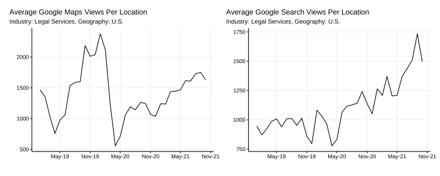
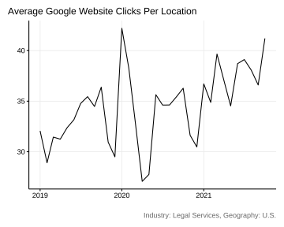

# Introduction 

Yext, a company providing _entreprise search_ solutions based on Natural Language Processing and AI, publish anonymized data on their [Search Data Hub](https://www.yext.com/search-data-hub). These data are samples of listing and local page data across a variety of search engines, and other digital endpoints collected by Yext from their clients. They allow for exploring insights on consumer behavior trends — including shifts in search volume and foot traffic trends by industry. 

We analyzed these data for the _Legal Services_ industry. What can we learn from Yext Search Data Hub that is relevant for personal injury lawyers? We present here our key findings.  

# Methodology
Yext kindly provided us with a subset of the data from the Search Data Hub: data about _Legal Services_ (subvertical) coming from U.S. companies. We enriched these data with some key spot comparisons observed directly on the online [Search Data Hub](https://www.yext.com/search-data-hub).  

## About the Data

Yext mentions that "the data is comprised of a sample of listing and local page data across a variety of search engines, and other digital endpoints. Insights are shown only on a region and industry level where there are sufficient businesses, locations, and search engine data sources to maintain anonymity and privacy for Yext customers and where Yext customers have adopted the platform for a sufficient period of time to provide a meaningful comparison year over year. As data may vary between regions due to, among other things, the sample size or availability of data for certain businesses and subverticals, industry insights may not be comparable across regions."   
The data published by Yext, and presented in this analysis, are better compared over time. However, as the metrics are averages over a sample, we can still compare the absolute values of the _legal services_ to the values of the rest of the industry.  

**Sample sizes:**  

* Sample Size for the "subvertical" of _Legal Services_ in the U.S.: 5,409 businesses including 7,249 entities.   
* Sample Size for the whole U.S., all the industries (all subverticals): 73,909 businesses including 545,974 entities.   

# Research Findings 

## Extended Network Impressions and Clicks

The _impressions_ represent the number of times a sample of listings appeared in search results across Google Maps, Google Search, Bing, Facebook, and the broader network. And the _clicks_, the number of times they were clicked.  

<!-- -->

There is a sudden increase in the _Average Extended Network Clicks_ since summer 2021.  

Visually, there does not seem to be a large correlation between the _impressions_ and the _clicks_. This is reflected in the Pearson correlation coefficient, which is $r = 0.21$. This coefficient ranges from 0, there is no linear correlation, the clicks have no relations to impressions, to 1, there is a perfect correlation between impressions and clicks. There is a small correlation between the number of impressions and the clicks, meaning that the number of clicks is not completely independent of the number of impressions. However, this relation is very far from being perfect and an increase in the number of impressions is not necessarily, directly and completely reflected in the number of clicks.  

### Click-Through Rate

As Yext is sharing both impressions and clicks, we can compute the average _Click-Through Rate_ (CTR): $CTR = clicks / impressions$. 

<!-- -->

The average CTR in _legal services_ for longtail keywords in the extended network (Google Maps, Google Search, Bing, Facebook, and the broader network) is of 2.62%.  

### Industry Comparison

We compare the Extended Network Impressions and Clicks from the _legal services_ to the same metrics for _all the industries_. By doing so, we compare the performance of listings in the _legal services_ to the global average.  

<!-- -->

The _Average Extended Network Impressions for Longtail Keywords_ for _all industries together_ is 2.7 times larger than for _legal services_. The gap is even larger for the _Clicks_: it is 9.3 times larger for _all industries together_ than for _legal services_. This suggests that, in this sample, _legal services_ have generally less success in turning impressions into clicks. This is reflected in the CTR. The CTR of all industries together is on average of 8.76%, much higher than the average CTR for the _legal services_: 2.62%.  

When measured on the whole industry, there is a much larger correlation between the impressions and the clicks: the Pearson correlation coefficient is $r = 0.82$. This means that fluctuations in the impressions are well reflected in the clicks, albeit not perfectly (perfectly would mean r = 1).  

## Google My Business

This chapter focuses on the Google ecosystem.  

### Impressions

The _Average Google Maps Views Per Location_ represents the number of times the listing was viewed on a Google Map. The _Average Google Search Views Per Location_ represents the number of times the listing was viewed on Google Search. Google Map Views and Google Search Views together represent the total number of impressions listings receive across the Google ecosystem.

The _Average Google Maps Views Per Location_ decreased by 73.6% between February and April 2020, at the beginning of the COVID pandemic, and is slowly recovering.   

The _Average Google Search Views Per Location_ is growing steadily since mid-2020. It has never been so high.   

We note the importance of a presence on Google Maps for companies active in _legal services_ as the average number of maps views is larger than the average number of search views.  

#### Industry Comparison

We compare the Google Maps and Search Views from the _legal services_ to the same metrics for _all the industries_. By doing so, we compare the performance of listings in the _legal services_ to the global average.   

<!-- -->

The trends in the _legal services_ follow the trends of the global average of all industries very well. With one notable difference, the average of Google Maps Views and Google Search Views per location is much smaller than the global average. The average of Google Maps Views in the _legal services_ is on average only 8.7% of the global average. The average of Google Search Views in the _legal services_ is on average only 14.7% of the global average.   

### Clicks

#### Google Phone Calls

The _Average Google Phone Calls Per Location_ represents the number of times a user clicked on the phone call link from a Google listing. There was a clear dip of around -30% at the onset of the COVID pandemic. This metric has reached the maximum level again since.    

<!-- -->

##### Industry Comparison

<!-- -->

On the contrary to the _legal services_, we do not see a gap at the onset of the COVID pandemic for the average of all industries. The _Average Google Phone Calls Per Location_ for the _legal services_ is only 16.6% of the global average.  

#### Google Website Clicks

The _Average Google Website Clicks Per Location_ represents the number of times a consumer clicked through to the corporate domain from a location page. It seems that there was a small dip at the onset of the COVID pandemic, but it is less clear.     

<!-- -->

##### Industry Comparison

<!-- -->

The _Average Google Website Clicks Per Location_ for the _legal services_ is fluctuating similarly to the average of all industries. The _Average Google Website Clicks Per Location_ for the _legal services_ is only 10.9% of the global average.  

#### Google Driving Directions

The _Average Google Driving Directions Per Location_ represents the number of times a consumer clicked to get driving directions from the location pages. This metric was clearly affected by the COVID pandemic. It dropped by 80% between February and April 2020. It is slowly recovering, now reaching about 80% of the pre-pandemic level.      

<!-- -->

##### Industry Comparison

<!-- -->

The _Average Google Driving Directions Per Location_ for the _legal services_ is behaving similarly to the average of all industries. The recovery after the onset of the pandemic is similar, albeit a bit slower. This might reflect the fact that _legal services_ can more easily managed remotely than other industries. The _Average Google Driving Directions Per Location_ for the _legal services_ is only 7% of the global average.  

# Summary and Main Findings

## The Impact of COVID

The COVID did not have an impact on all metrics shared by Yext. But it had a clear impact on Google Maps Views and Google Driving Directions; they dropped significantly (-75% and -80%). They almost reached their pre-pandemic level again, probably illustrating a near-total recovery of in-person business for legal services.   

Did COVID have a lasting effect on some metrics? Google Search Views are increasing constantly since mid-2020. Regardless of if this effect is due to an increased online presence of clients due to COVID, it is a good time to optimize Google Search Clicks and take advantage of this fact.

## Legal Services Perform Worse Than the Average

On all metrics provided by Yext, legal services performed only 10% to 30% of the industry's average value. So there is room for growth. 

| Metric        | Percentage of Industry Average  |
| :------------ |:-------------| 
| Average Extended Network Impressions for Longtail Keywords     | 37% | 
| Average Extended Network Clicks for Longtail Keywords    | 10.8%      |  
| Average Extended Network CTR for Longtail Keywords | 29.9%     | 
| Average Google Maps Views Per Location | 8.7%      | 
| Average Google Search Views Per Location | 14.7%      | 
| Average Google Phone Calls Per Location | 16.6%      | 
| Average Google Website Clicks Per Location | 10.9%      | 
| Average Google Driving Directions Per Location  | 7%      | 

## Imperfect Correlation Between Impressions and Clicks

There is not a perfect correlation between the _Average Extended Network Impressions_ and _Average Extended Network Clicks_ for longtail keywords. We could expect that when impressions increase, clicks directly follow. This works quite well when looking at the average of the whole industry, the Pearson correlation coefficient (r) is 0.82 (no correlation is 0 and perfect correlation is 1). Fluctuations in the impressions are well reflected in the clicks, albeit not perfectly.  

However, this is not the case for the legal services, the Pearson correlation coefficient (r) is only 0.21. It is unclear why fluctuations in the impressions are less well reflected in the clicks for legal services. It could be an artifact due to the smaller samples size, but Yext is publishing data about 5,409 businesses active in the legal services. That is a quite large sample already.  

