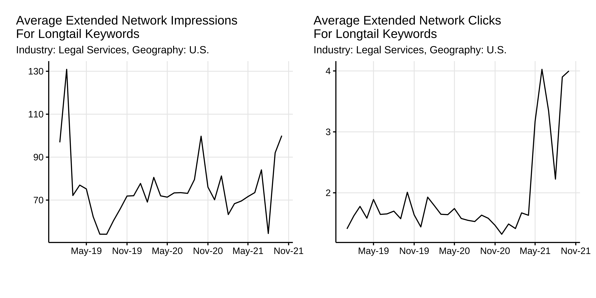
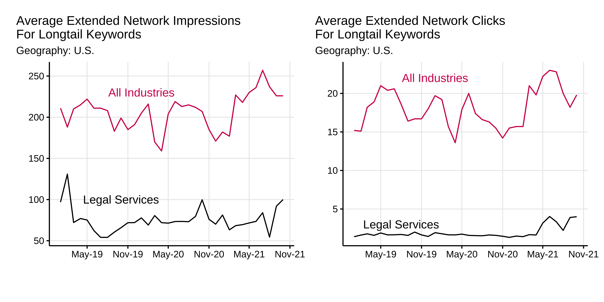
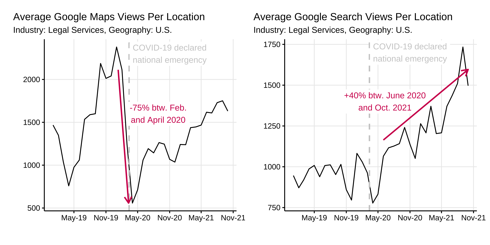
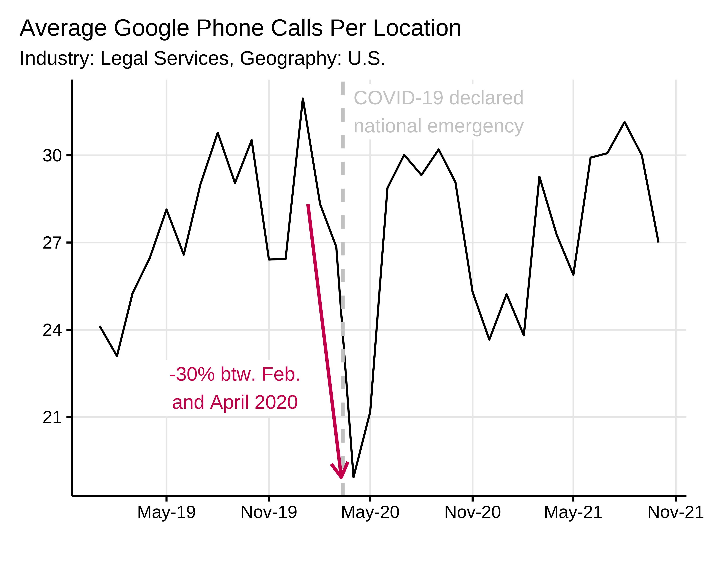
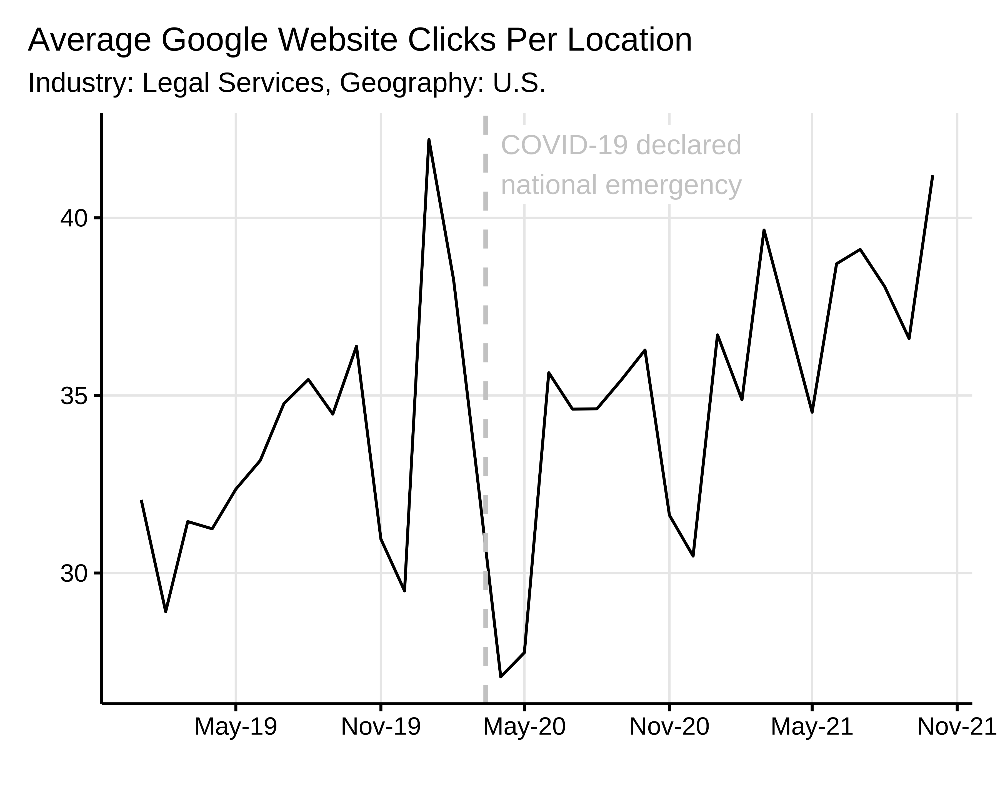
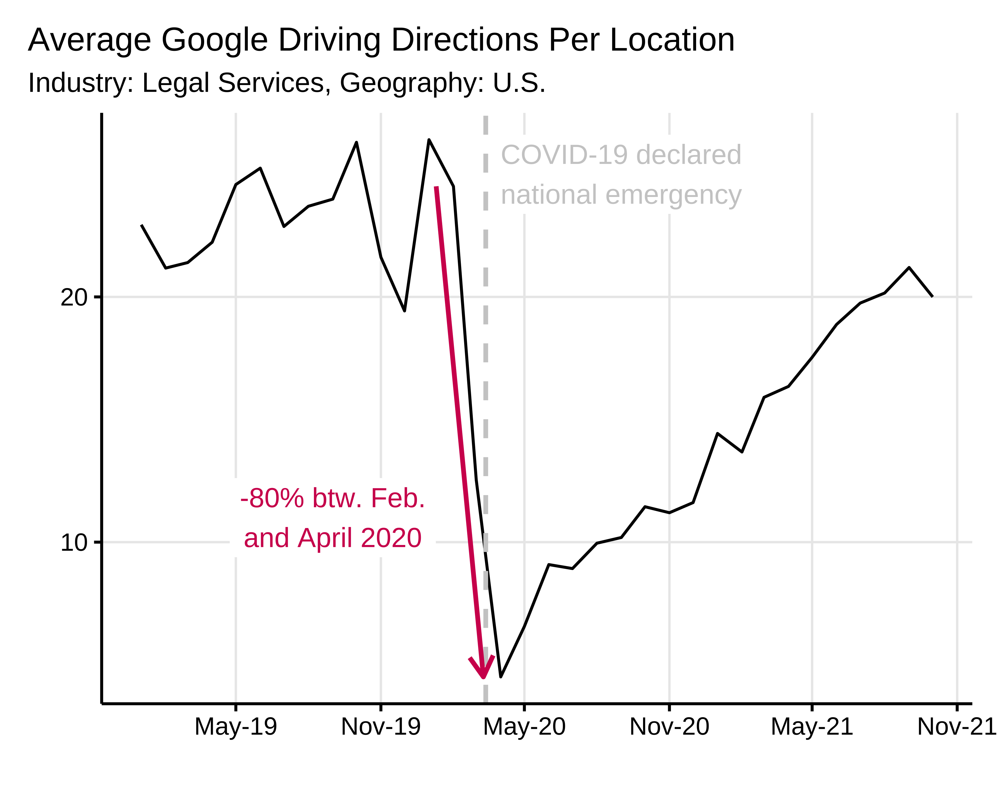
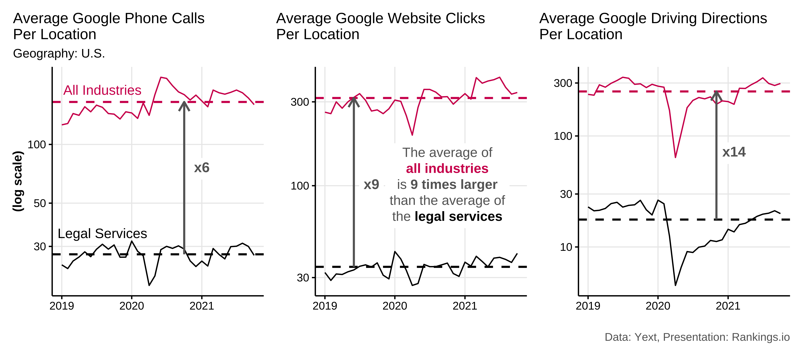

# Introduction 

Yext, a company that provides enterprise search solutions based on natural language processing and artificial intelligence, publishes anonymized data on its [Search Data Hub](https://www.yext.com/search-data-hub).. The data it contains are samples of listing and local page data across a variety of search engines and other digital endpoints collected by Yext from its clients. Yext enables the exploration of insights into consumer behavior trends, including shifts in search volume and foot traffic trends by industry.  

We analyzed the data for the legal services industry. What can we learn from the Yext Search Data Hub that is relevant for personal injury lawyers? We present our key findings here.

# Methodology
Yext kindly provided us with a subset of the data from its Search Data Hub—data about legal services (subvertical) from U.S. companies. We enriched these data with some key spot comparisons observed directly on the online [Search Data Hub](https://www.yext.com/search-data-hub).  

## About the Data

Yext mentions that “the data is comprised of a sample of listing and local page data across a variety of search engines, and other digital endpoints. Insights are shown only on a region and industry level where there are sufficient businesses, locations, and search engine data sources to maintain anonymity and privacy for Yext customers and where Yext customers have adopted the platform for a sufficient period of time to provide a meaningful comparison year over year. As data may vary between regions due to, among other things, the sample size or availability of data for certain businesses and subverticals, industry insights may not be comparable across regions.”   
The data published by Yext and presented in this analysis are best compared over time. However, because the metrics are averages over a sample, we can still compare the absolute values of the _legal services_ to the values of the rest of the industry.

**Sample sizes:**  

* Sample Size for the "subvertical" of _legal services_ in the United States: 5,409 businesses including 7,249 entities.   
* Sample Size for the whole United States, all industries (all subverticals): 73,909 businesses including 545,974 entities   

# Research Findings 

## Extended Network Impressions and Clicks

_Impressions_ represent the number of times a sample of listings appeared in search results across Google Maps, Google Search, Bing, Facebook, and the broader network, and _clicks_ are the number of times they were clicked.    

There was a sudden increase in the _average extended network clicks_ since summer 2021.  

Visually, there does not seem to be a strong positive correlation between _impressions_ and _clicks._ This is reflected in the Pearson correlation coefficient, which is $r = 0.21$. This coefficient ranges from 0, indicating that there is no linear correlation between clicks and impressions, to 1, indicating that there is a perfect correlation between impressions and clicks. There is a small correlation between the number of impressions and clicks, meaning that clicks is not completely independent of impressions. However, this relation is very far from being perfect and an increase in impressions is not necessarily, directly, and completely reflected in the number of clicks.  

### Click-Through Rate

Because Yext shared data about both impressions and clicks, we can compute the average _click-through rate_ (CTR): $CTR = clicks / impressions$. 

The average CTR in _legal services_ for longtail keywords in the extended network (Google Maps, Google Search, Bing, Facebook, and the broader network) is of 2.62%.  

### Industry Comparison

We compare the numbers of extended network impressions and clicks in the legal services sector to the same averaged metrics for all industries. By doing so, we compare the performance of legal services listings to the global average.  

When measured across all industries, there is a much larger correlation between impressions and clicks: the Pearson correlation coefficient is $r = 0.82$. This means that fluctuations in impressions are well reflected in clicks, albeit not perfectly (perfectly would mean r = 1).    

The _average extended network impressions for longtail keywords_ for _all industries together_ is 2.7 times larger than for _legal services_. The gap is even larger for the _Clicks_: it is 9.3 times larger for _all industries together_ than for _legal services_. This suggests that, in this sample, _legal services_ generally have less success in turning impressions into clicks. This is reflected in the CTR. The CTR of all industries together is on average of 8.76%, much higher than the average CTR for the _legal services_, 2.62%.  

We can index the values measured for the _legal services_ sector and _all industries_ to the value of 100% in January 2019. By doing so, we can precisely compare their trends and determine whether the values for the legal services follow the same fluctuations as those for all industries.    

We can see that the _clicks_ in the _legal services_ seem to follow the general trends well. This is reflected in the Pearson correlation coefficient: $r = 0.57$. However, this is does not seem to be the case for the _impressions_. The _impressions_ in the _legal services_ sector do not visually follow the general trends well and there is no correlation: $r = 0$. Could this be because the impressions do not depend from the general presence or behavior of users whereas the clicks do?   

## Google My Business

This chapter focuses on the Google ecosystem.   

### Impressions

The _average Google Maps views per location_ represents the number of times a listing was viewed on a Google Map. The _average Google Search views per location_ represents the number of times a listing was viewed on Google Search. Google Map views and Google Search views together represent the total number of impressions listings receive across the Google ecosystem.  

The _average Google Maps views per location_ decreased by 73.6% between February and April 2020, at the beginning of the COVID pandemic, and is slowly recovering   

The _average Google Search views per location_ has been growing steadily since mid-2020. It has never been so high.    

We note the importance of having a presence on Google Maps for companies that are active in the _legal services_ sector because the average number of map views is larger than the average number of search views.  

#### Industry Comparison

We compared the Google Maps and Google Search views in the _legal services_ sector to the same metric averages for _all industries_. By doing so, we compared the performance of listings in the _legal services_ sector to the global average.

The trends in the _legal services_ sector follow the global average trends in all industries very well with one notable difference, the average Google Maps views and Google Search views per location are much lower than the global averages. The average Google Maps views in the _legal services_ sector is only 8.7% of the global average. The average Google Search views in the _legal services_ sector is on average only 14.7% of the global average for all industries. Note the logarithmic scale on the y-axis. It is used because it allows for a better comparison of the trends, despite their difference in magnitude.   

### Clicks

#### Google Phone Calls

_Average Google Phone Calls Per Location_ represents the number of times uses clicked on the phone call link from a Google listing. There was a clear dip of around -30% at the onset of the COVID pandemic. This metric has reached the maximum level again since then.     

#### Google Website Clicks

_Average Google Website Clicks Per Location_ represents the number of times a consumer clicked through to the corporate domain from a location page. It seems that there was a small dip at the onset of the COVID pandemic, but it is less clear.      

#### Google Driving Directions

_Average Google Driving Directions Per Location_ represents the number of times consumers clicked to get driving directions from a location page. This metric was clearly affected by the COVID pandemic. It dropped by 80% between February and April 2020. It is slowly recovering, now reaching about 80% of its pre-pandemic level.       

#### Industry Comparison

Contrary to in the _legal services_ sector, we do not see a gap at the onset of the COVID pandemic for the average of all industries. The _Average Google Phone Calls Per Location_ for the legal services sector is only 16.6% of the global average.   

The _Average Google Website Clicks Per Location_ for the _legal services_ sector fluctuates similarly to the average for all industries. It is only 10.9% of the global average.   

The _Average Google Driving Directions Per Location_ for the _legal services_ is behaving similarly to the average of all industries. The recovery after the onset of the pandemic is similar, albeit a bit slower. This might reflect the fact that _legal services_ can more easily be managed remotely than other industries. The _Average Google Driving Directions Per Location_ for the _legal services_ is only% of the global average.  
The _Average Google Driving Directions Per Location_ for the _legal services_ sector is similar to the average for all industries. The recovery after the onset of the pandemic is similar, albeit a bit slower. This might reflect the fact that _legal services_ listings can be more easily managed remotely than listings in other industries. The _Average Google Driving Directions Per Location_ for the legal services sector is only 7% of the global average.

# Summary and Main Findings

## The Impact of COVID

COVID did not have an impact on all metrics shared by Yext, but it had a clear impact on Google Maps views and Google Driving Directions; they dropped significantly (by -75% and -80%, respectively). They almost reached their pre-pandemic level again, probably illustrating a near-total recovery of in-person business for legal services.     

Did COVID have a lasting effect on some metrics? Google Search views have been constantly increasing since mid-2020. Regardless of whether this effect is due to the increased online presence of users due to COVID, it is a good time to optimize Google Search Clicks and take advantage of this fact.   

## Legal Services Perform Worse Than the Average

Among all the metrics provided by Yext, legal services only performed at 10 to 30% of the industry’s average. For instance, the number of impressions for longtail keywords for legal services is only 37% of that of the same metric for the average of all industries.     

| Metric      | Percentage of Industry Average  |
| :------------ |:-------------| 
| Average Extended Network Impressions for Longtail Keywords     | 37% | 
| Average Extended Network Clicks for Longtail Keywords    | 10.8%      |  
| Average Extended Network CTR for Longtail Keywords | 29.9%     | 
| Average Google Maps Views Per Location | 8.7%      | 
| Average Google Search Views Per Location | 14.7%      | 
| Average Google Phone Calls Per Location | 16.6%      | 
| Average Google Website Clicks Per Location | 10.9%      | 
| Average Google Driving Directions Per Location  | 7%      | 

This “underperformance” could simply be due to the fact that legal services are not as in-demand as the average of all industries. Still, CTR, for instance, is not directly demand-dependent. It seems that legal services can improve their longtail keyword CTR.     

## Imperfect Correlation Between Impressions and Clicks

There is not a perfect correlation between _average extended network impressions_ and _average extended network clicks_ for longtail keywords. We expect that when impressions increase, clicks directly follow. This works quite well when looking at the average for the whole industry, the Pearson correlation coefficient (r) is 0.82 (no correlation is represented by 0 and a perfect correlation is represented by 1). Fluctuations in the impressions are well reflected in the clicks, albeit not perfectly.   

However, this is not the case for legal services, for which the Pearson correlation coefficient (r) is only 0.21. It is unclear why fluctuations in impressions are less well reflected by clicks for legal services. It could be an artifact due to the small samples size, but Yext publishes data about 5,409 businesses that are active in the legal services industry, which is a quite large sample.

